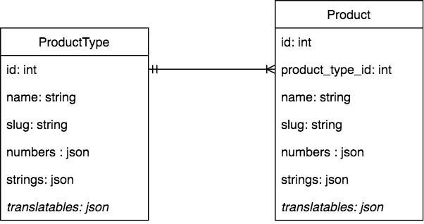
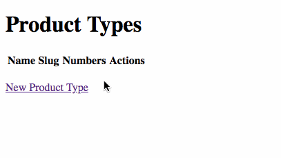
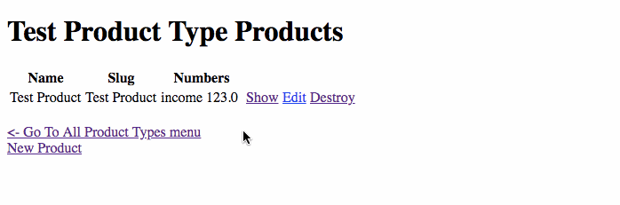

# Shopfront

Shopfront demonstrates a very simple concept that the product attributes can be defined by admin users. Which in turns got reflected in admin and front end.

## Diagram

Note: The _italic_ fields has not been implemented yet.

Product attributes (based on it's type) can be defined based on the fields defined in ProductType.

## Screencasts

- Definining new Product Type and specify a dynamic attributes:
  

- Updating existing Product Type and add a new dynamic attributes:
  

## ToDos

- Basic Product Front End
- Translatable fields
- Sortable fields
- Sortable features
- Filters

Things you may want to cover:

* Ruby version

* System dependencies

* Configuration

* Database creation

* Database initialization

* How to run the test suite

* Services (job queues, cache servers, search engines, etc.)

* Deployment instructions

* ...
